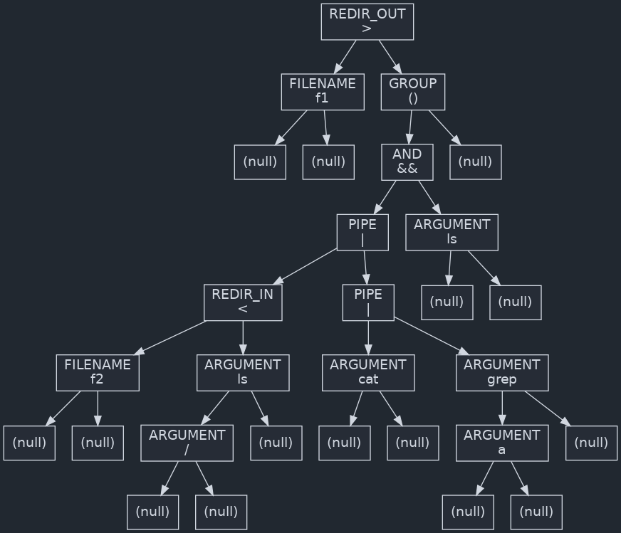

# minishell

Minishell is a minimalistic shell implementation inspired by bash.

## Features

- Basic command execution
- Input/output redirection
- Pipe handling
- Grouping and logical operators
- Environment variable management

## Installation

Clone the repository and compile the source code:

```sh
git clone https://github.com/vicxptrv/42Core/minishell.git
cd minishell
make
```

## Usage

Compile the shell:
```sh
make
```

Run the shell:
```sh
./minishell
```

Try any commands:
```sh
ls > f1
```
```sh
sleep 3 | ls
```
```sh
( < f2 ls / | cat | grep a && ls ) > f1
```

## Parsing Implementation

Parsing consists of two parts: lexer and syntaxer.

### Lexer

The lexer splits the user prompt into lexemes and checks if they are valid for the minishell language. If no errors are found, it creates a list of verified tokens and passes them to the syntaxer for processing.

### Syntaxer

The syntaxer takes the list of valid tokens and creates an Abstract Syntax Tree (AST).

For the statement:
```sh
(<f2 ls / | cat | grep a && ls) >f1
```

The resulting tree is created during runtime using Graphviz
looks like this:


### Grammar Representation

The grammar used by the syntaxer is represented in Backus-Naur Form (BNF):

```bnf
<statement>        ::= <list> '\n'

<list>             ::= <pipeline> {('&&' | '||') <pipeline>}*

<pipeline>         ::= <expression> { '|' <expression> }*

<expression>       ::= {<word> | <redirection>}*
                      | <group> <redirection>*

<group>            ::= '(' <list> ')'

<redirection>      ::=  '>' <word>
                      |  '<' <word>
                      |  '>>' <word>
                      |  '<<' <word>

<word>             ::= 'characters'
```

## License

This project is licensed under the MIT License.