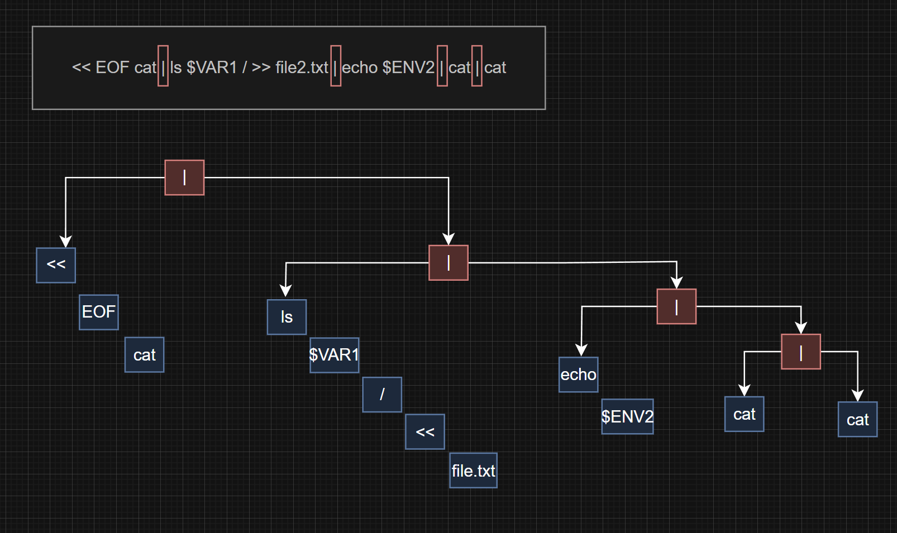

# Minishel

Minishel is a minimalistic shell implementation for Unix-based systems.

## Features

- Basic command execution
- Input/output redirection
- Pipe handling
- Environment variable management

## Installation

Clone the repository and compile the source code:

```sh
git clone git@github.com:42Core-vvoronts/minishel.git
cd minishel
make
```

## Usage

Compile the shell:
```sh
make
```

Run the shell:
```sh
./minishel
```

Run cmdline:
```sh
<< EOF cat | ls $VAR1 / >> file2.txt | echo $ENV2 | cat | cat
```

Result:


## License

This project is licensed under the MIT License.