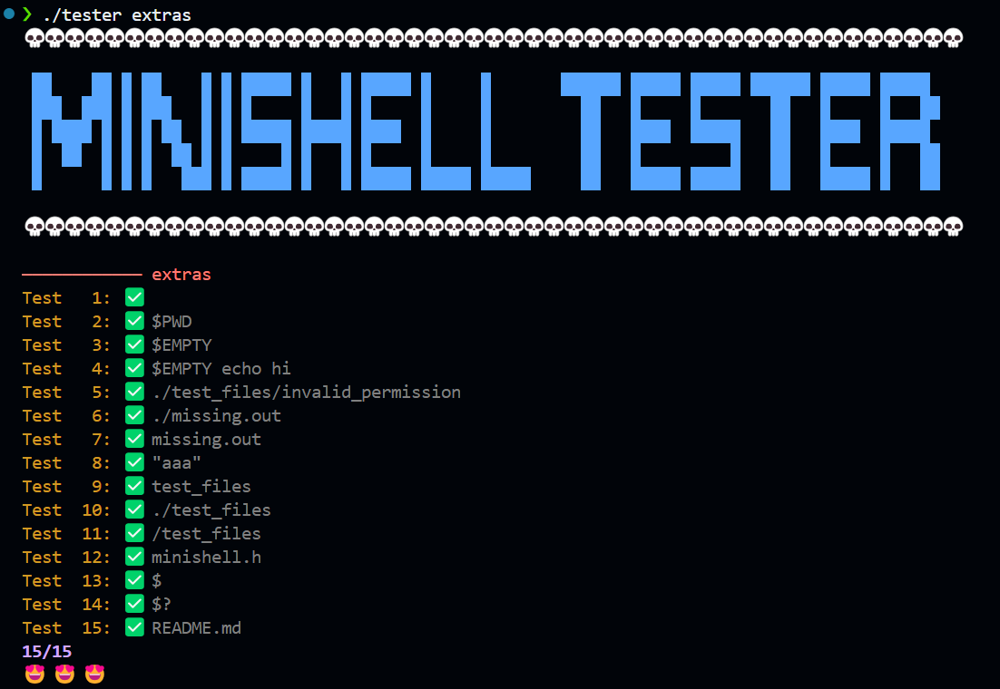

# minishell

Minishell is a minimalistic shell implementation inspired by bash.

## Contributors  
- **Parsing:** [VICXPTRV](https://github.com/VICXPTRV)  
- **Execution:** [IVNXPTRV](https://github.com/IVNXPTRV)  

## Features

- Redirections: `<` `>` `>>` `<<`  
- Pipe handling: `|`  
- Grouping: `()`  
- Logical operators: `&&` `||`  
- Environment variable management: `$`  
- Wildcards: `*` 

## Installation and Usage

Clone the repository and compile the source code:

```sh
git clone https://github.com/vicxptrv/42Core/minishell.git
cd minishell
make
./minishell
```

Try any commands:
```sh
(< f2 ls / | cat | grep a && ls) > f1
```

## Parsing Implementation

Parsing was inspired by https://github.com/mit-pdos/xv6-riscv/tree/riscv.

### Grammar Representation

The grammar used by the syntaxer is represented in Backus-Naur Form (BNF):

```bnf
<statement>        ::= <list> '\n'

<list>             ::= <pipeline> {('&&' | '||') <pipeline>}*

<pipeline>         ::= <expression> { '|' <expression> }*

<expression>       ::= {<word> | <redirection>}*
                      | <group> <redirection>*

<group>            ::= '(' <list> ')'

<redirection>      ::=  '>' <word>
                      |  '<' <word>
                      |  '>>' <word>
                      |  '<<' <word>

<word>             ::= 'characters'
```

### Lexer

The lexer verifies each lexeme of the user’s prompt and creates a list of verified tokens, passing them to the syntaxer for processing.

### Syntaxer

The syntaxer takes the list of valid tokens and creates an Abstract Syntax Tree (AST).

For the statement:
```sh
(<f2 ls / | cat | grep a && ls) >f1
```

During runtime, the resulting tree is generated using Graphviz and looks like this:


## Tester

An adapted version of [LucasKuhn's Minishell Tester](https://github.com/LucasKuhn/minishell_tester).  
Adds compilation, leak testing, and syntax tree visualization with Graphviz. 

### Usage  

Run tester:

```sh
cd tester
./tester 
```
### Flags 
- Debug a specific prompt `-d`
- Run make before testing `-m`
- Enable output printing `-p` (works only in this specific project, you can try adjust for your own: look to ./tester/printer/main.c)

```sh
./tester -dmp 
```

Sample of test:

